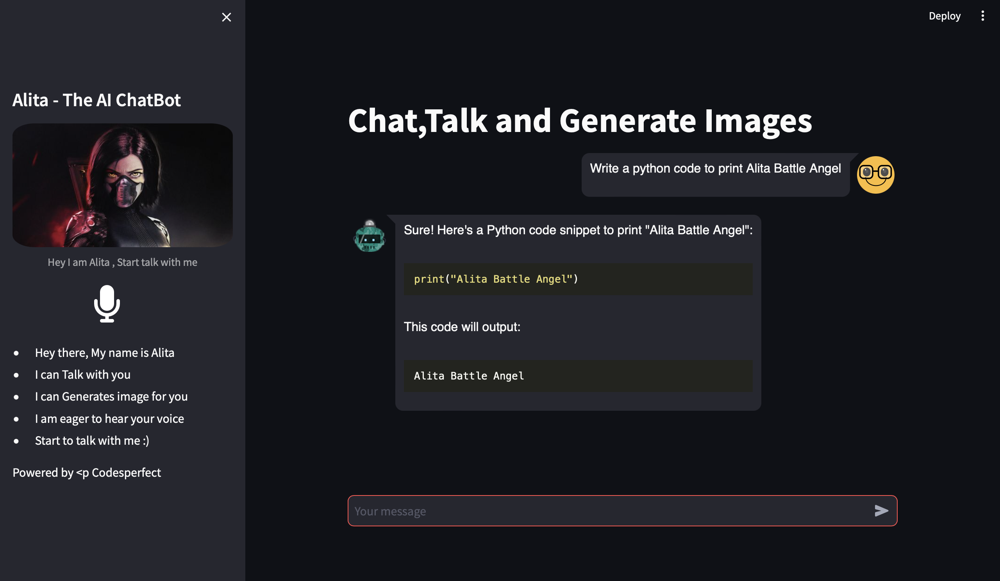

# <p align="center">**Alita Battle Angel Ai ChatGPT + DallE + Whishper** (Version 1.0.0)

- <p align="center">An Ai which can response for your questions,doubts,chats and also generate Images.</p>


## **Get Started**

- [Clone This Project](#git-clone)
- [Set Environment Variables](#environmental-variables)
- [Installing Packages](#installing-requirements)
- [Run App](#running-application)
- [Results](#results)


### **Git clone**

<p> Use below command to clone this repository.</p>

``` 
https://github.com/codesperfect/AlitaAi.git
```


## **Environmental Variables**

<p>In <a color="blue">.env</a> file you can see variables given below</p>

```
OPENAI_API = "<OPENAI_API>" 
```
Replace ```<OPENAI_API>``` with your openai api key

## **Installing Requirements**

Install required python package using the below command

```sh
pip install -r requirements.txt
```

## **Running Application**

Use the below code to run this AI Web in linux.


```sh
streamlit run ai.py
```

### **Results**
---

 - Here the results of the Alita Battle Angel Ai


<br>

### **Ask any code**


<br>

### **Ask to Generate Image**
- Asking to generate in your natural language


- Asking to make changes in previous image


[!NOTE]  
The changes in the image not based on the generated input but based on previous request.

<br>

### **THANK YOU :)**
---


